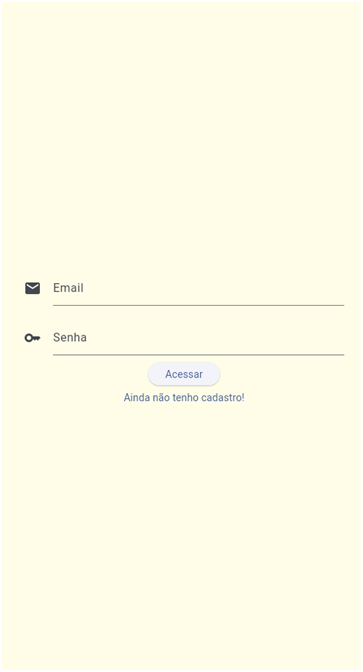
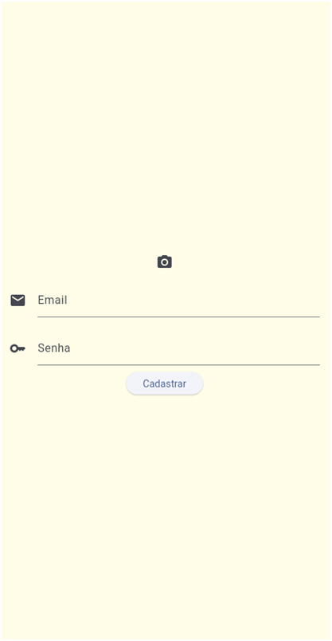
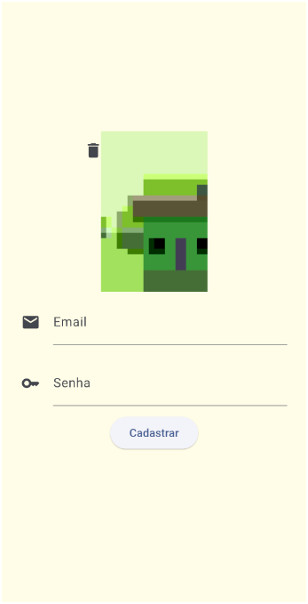
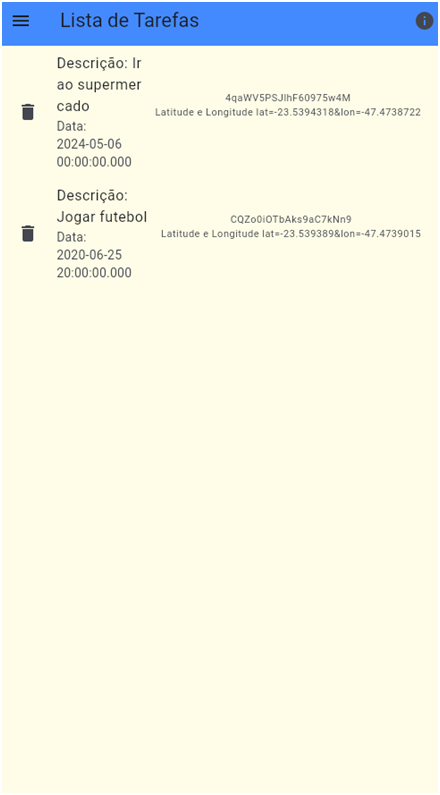
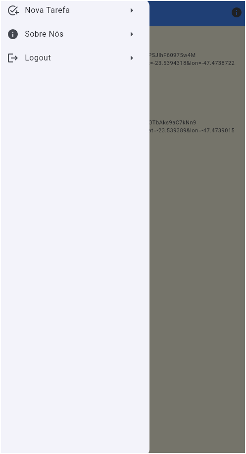
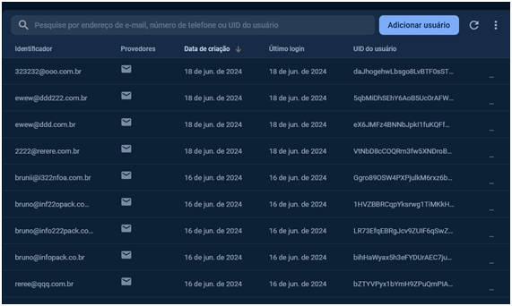
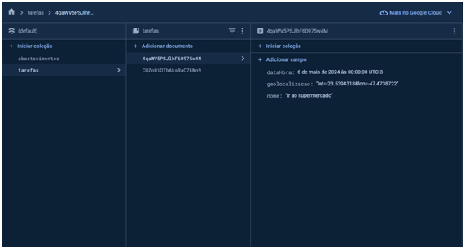

#Aluno:Bruno Rodrigues dos Santos Silva

Disciplina: Integrações e Publicação de Apps Flutter [24E2_3] 

#Prints

TELA DE LOGIN (SIGIN)

TELA DE SIGNOUT

TELA API INTERNA CAMERA

TELA HOME

EDITAR TAREFA COM API EXTERNA HTTPS

TELA DRAWER

TELA FIREBASE AUTH

TELA FIREBASE STORAGE

